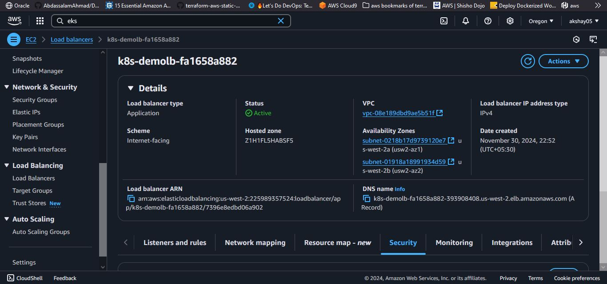
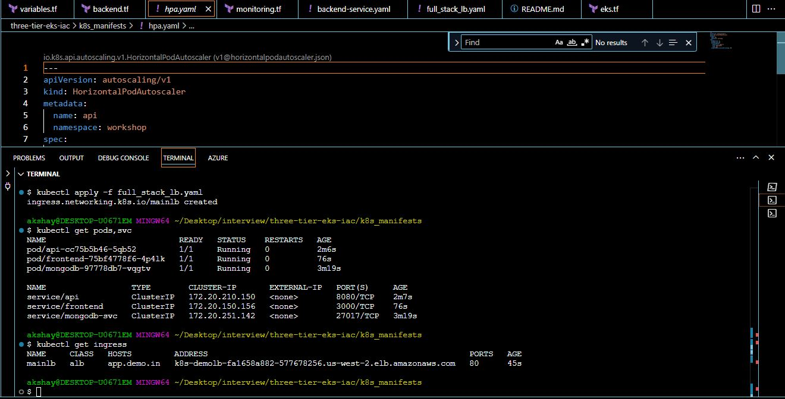
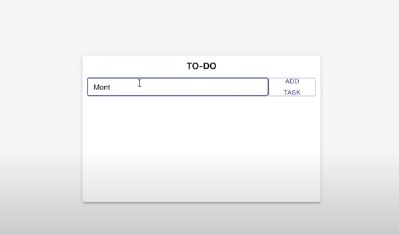
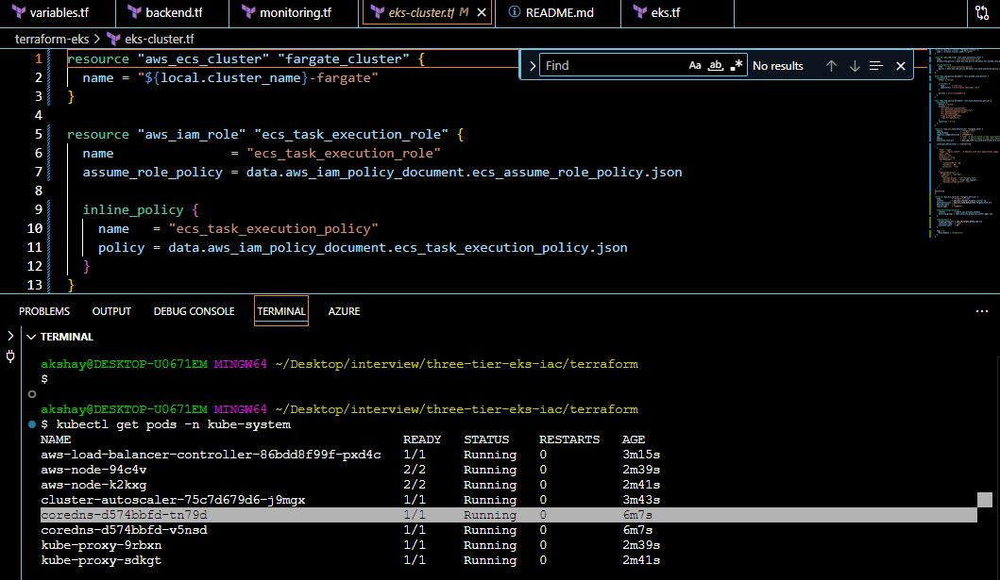
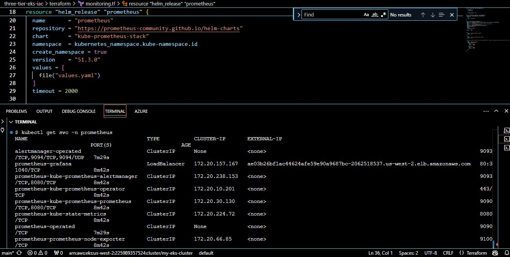
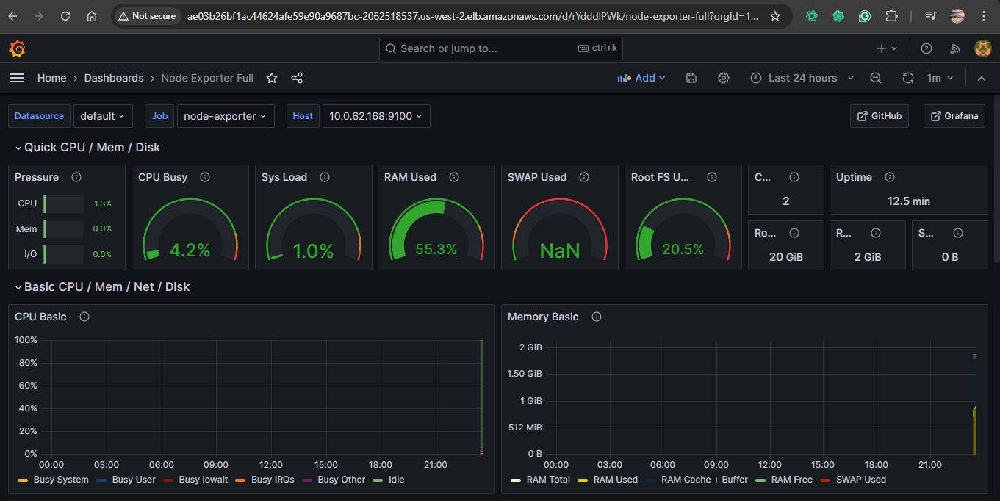

# EKS-iac-3Tire-app_&_monitoring  

# Prerequisite 

**Install Kubectl**
https://kubernetes.io/docs/tasks/tools/


**Install Helm**
https://helm.sh/docs/intro/install/

```
helm repo update
```

**Install/update latest AWS CLI:** (make sure install v2 only)
https://aws.amazon.com/cli/


#update the Kubernetes context
aws eks update-kubeconfig --name my-eks-cluster --region us-west-2

# verify access:
```
kubectl auth can-i "*" "*"
kubectl get nodes
```

# Verify autoscaler running:
```
kubectl get pods -n kube-system
```

# Check Autoscaler logs
```
kubectl logs -f \
  -n kube-system \
  -l app=cluster-autoscaler
```

# Check load balancer logs
```
kubectl logs -f -n kube-system \
  -l app.kubernetes.io/name=aws-load-balancer-controller
```

<!-- aws eks update-kubeconfig \
  --name my-eks \
  --region us-west-2 \
  --profile eks-admin -->


# Buid Docker image :
**For Mac:**

```
export DOCKER_CLI_EXPERIMENTAL=enabled
aws ecr-public get-login-password --region us-east-1 | docker login --username AWS --password-stdin public.ecr.aws/w8u5e4v2
```

Buid Front End :

```
docker buildx build --platform linux/amd64 -t workshop-frontend:v1 . 
docker tag workshop-frontend:v1 public.ecr.aws/w8u5e4v2/workshop-frontend:v1
docker push public.ecr.aws/w8u5e4v2/workshop-frontend:v1
```


Buid Back End :

```
docker buildx build --platform linux/amd64 -t workshop-backend:v1 . 
docker tag workshop-backend:v1 public.ecr.aws/w8u5e4v2/workshop-backend:v1
docker push public.ecr.aws/w8u5e4v2/workshop-backend:v1
```

**For Linux/Windows:**

Buid Front End :

```
docker build -t workshop-frontend:v1 . 
docker tag workshop-frontend:v1 public.ecr.aws/w8u5e4v2/workshop-frontend:v1
docker push public.ecr.aws/w8u5e4v2/workshop-frontend:v1
```


Buid Back End :

```
docker build -t workshop-backend:v1 . 
docker tag workshop-backend:v1 public.ecr.aws/w8u5e4v2/workshop-backend:v1
docker push public.ecr.aws/w8u5e4v2/workshop-backend:v1
```

**Update Kubeconfig**
Syntax: aws eks update-kubeconfig --region region-code --name your-cluster-name
```
aws eks update-kubeconfig --region us-west-2 --name my-eks-cluster
```


**Create Namespace**
```
kubectl create ns workshop

kubectl config set-context --current --namespace workshop
```

# MongoDB Database Setup

**To create MongoDB Resources**
```
cd k8s_manifests/mongo_v1
kubectl apply -f secrets.yaml
kubectl apply -f deploy.yaml
kubectl apply -f service.yaml
```

# Backend API Setup

Create NodeJs API deployment by running the following command:
```
kubectl apply -f backend-deployment.yaml
kubectl apply -f backend-service.yaml
```


**Frontend setup**

Create the Frontend  resource. In the terminal run the following command:
```
kubectl apply -f frontend-deployment.yaml
kubectl apply -f frontend-service.yaml
```

Finally create the final load balancer to allow internet traffic:
```
kubectl apply -f full_stack_lb.yaml
```










# Any issue with the pods ? check logs:
```
kubectl logs -f POD_ID -f
```


# Grafana setup 

**Verify Services**
```
kubectl get svc -n prometheus
```

**edit the Prometheus-grafana service:**
```
kubectl edit svc prometheus-grafana -n prometheus
```

**change ‘type: ClusterIP’ to 'LoadBalancer'**

Username: admin
Password: prom-operator


Import Dashboard ID: 1860

Exlore more at: https://grafana.com/grafana/dashboards/




   


# Destroy Kubernetes resources and cluster
```
cd ./k8s_manifests
kubectl delete -f -f
```
**Remove AWS Resources to stop billing**
```
cd terraform
terraform destroy --auto-approve
```


